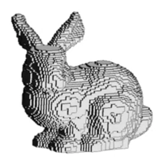
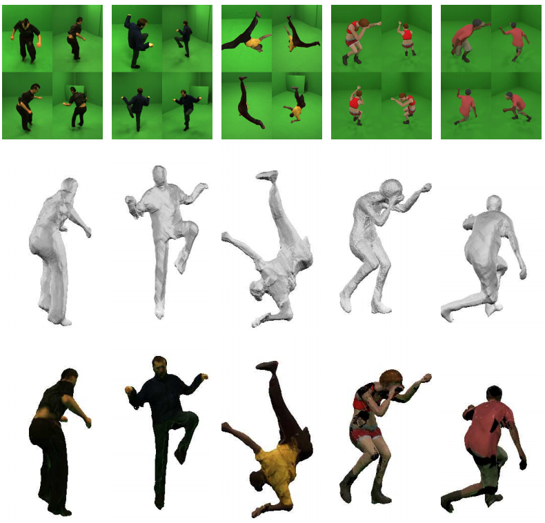
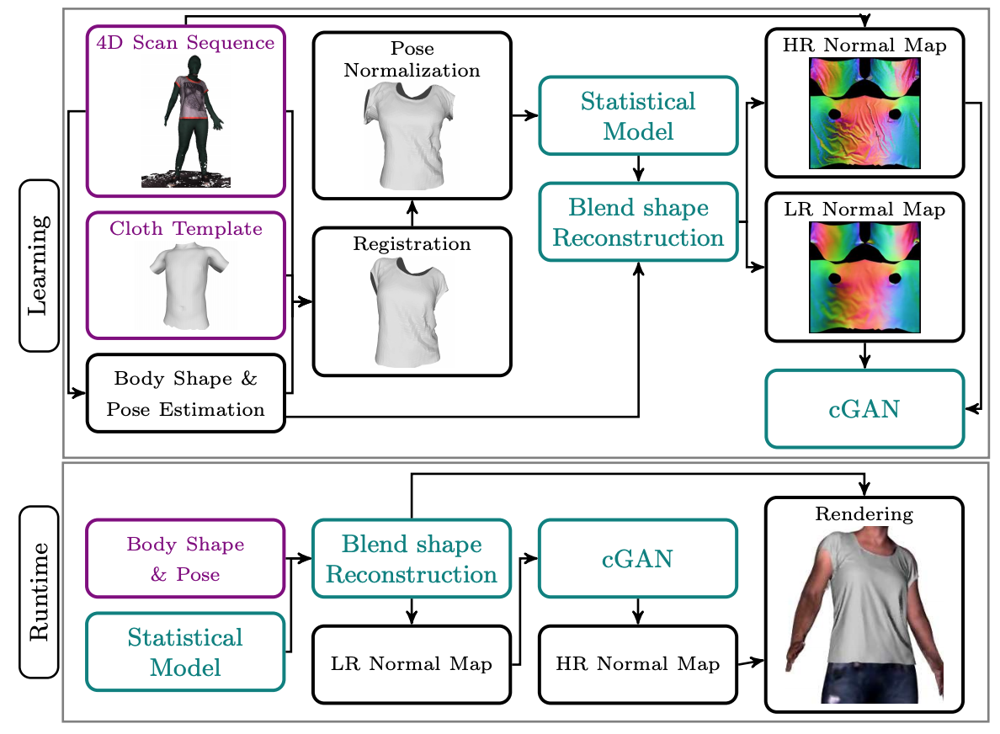

# 3D Human 相关研究总结（Body、Pose、Reconstruction、Cloth、Animation）

**作者：张莹	单位：腾讯**

## 前言

本文简要介绍与3D数字人相关的研究，包括常用3D表示、常用3D人体模型、3D人体姿态估计，带衣服3D人体重建，3D衣服建模，以及人体动作驱动等。

-----

## 常用3D表示

目前3D 学习中，物体或场景的表示包括**显式表示**与**隐式表示**两种，主流的显式表示包括基于voxel、基于point cloud、和基于polygon mesh三种，隐式表示包括基于Occupancy Function[1]、和基于Signed Distance Functions[2]两种。下表简要总结了各种表示方法的原理及其相应优缺点。

<table>     
  <tr>         
	<th width="5%">
表示方法
</th><th width="19%">
Voxel
</th><th width="19%">
Point Cloud
</th><th width="19%">
Polygon Mesh
</th><th width="19%">
Occupancy Function
</th><th width="19%">
Signed Distance Function
</th>                 
 </tr>
<tr>         
  <td>表示图像</td> <td></td><td></td><td></td><td></td><td></td>   
 </tr>
<tr>         
  <td>表示原理</td> <td>体素用规则的立方体表示3D物体，体素是数据在三维空间中的最小分割单位，类似于2D图像中的像素</td><td>点云将多面体表示为三维空间中点的集合，一般用激光雷达或深度相机扫描后得到点云数据</td><td>多边形网格将多面体表示为顶点与面片的集合，包含了物体表面的拓扑信息</td><td>occupancy function 将物体表示为一个占有函数，即空间中每个点是否在表面上</td><td>SDF 将物体表示为符号距离函数，即空间中每个点距离表面的距离</td>   
 </tr>
  <tr>         
  <td>优缺点</td> <td>+ 规则表示，容易送入网络学习  + 可以处理任意拓扑结构  - 随着分辨率增加，内存呈立方级增长 - 物体表示不够精细 - 纹理不友好</td><td>+ 容易获取 + 可以处理任意拓扑结构 - 缺少点与点之间连接关系 - 物体表示不够精细 - 纹理不友好</td><td>+ 高质量描述3D几何结构 + 内存占有较少  + 纹理友好 -  不同物体类别需要不同的 mesh 模版 - 网络较难学习</td><td>+ 可以精细建模细节，理论上分辨率无穷 + 内存占有少  + 网络较易学习  - 需后处理得到显式几何结构</td><td>+ 可以精细建模细节，理论上分辨率无穷 + 内存占有少  + 网络较易学习  - 需后处理得到显式几何结构</td>   
 </tr>  
</table>

[1] [Occupancy Networks: Learning 3D Reconstruction in Function Space](https://openaccess.thecvf.com/content_CVPR_2019/papers/Mescheder_Occupancy_Networks_Learning_3D_Reconstruction_in_Function_Space_CVPR_2019_paper.pdf). In CVPR, 2019.

[2] [DeepSDF: Learning Continuous Signed Distance Functions for Shape Representation](https://openaccess.thecvf.com/content_CVPR_2019/papers/Park_DeepSDF_Learning_Continuous_Signed_Distance_Functions_for_Shape_Representation_CVPR_2019_paper.pdf). In CVPR, 2019.

-----

## 常用3D人体模型

目前常用的人体参数化表示模型为德国马克斯•普朗克研究所提出的**SMPL**[3]，该模型采用6890个顶点（vertices）, 和13776 个面片（faces）定义人体 template mesh，并采用10维参数向量控制人体shape，24个关节点旋转参数控制人体pose，其中每个关节点旋转参数采用3维向量来表示该关节相对其父关节分别沿着x,y,z轴的旋转角。该研究所在CVPR 2019上提出 SMPL-X [4]，采用了更多顶点来精细建模人体，并加入了面部表情和手部姿态的参数化控制。这两篇工作给出了规范的、通用的、可以与工业3D软件如Maya和Unity相通的人体参数化表示，并提出了一套简单有效的蒙皮策略，使得人体表面的顶点跟随关节旋转运动时不会产生明显瑕疵。近年来也有不少改进的人体模型，如SoftSMPL[5]，STAR[6]，BLSM[7]，GHUM[8]等。

<table>     
  <tr>         
    <th width="10%">
人体模型
</th><th width="46%">
SMPL
</th><th width="44%">
SMPL-X
</th>     
  </tr> 
    <tr>         
    <td>
基本表示
</td><td>&bull; mesh表示：6890 vertices, 13776 faces  &bull; pose控制：24个关节点，24*3维旋转向量 &bull; shape控制：10维向量</td><td>&bull; mesh表示：10475 vertices, 20908 faces  &bull; pose控制：身体54个关节点，75维PCA &bull; 手部控制：24维PCA &bull; 表情控制：10维向量 &bull; shape控制：10维向量 </td>   
  </tr>
	<tr>         
    <td>
示意图
</td><td></td><td></td>   
	</tr>
</table>

[3] [SMPL: A Skinned Multi-Person Linear Model](http://files.is.tue.mpg.de/black/papers/SMPL2015.pdf). In SIGGRAPH Asia, 2015.

[4] [Expressive Body Capture: 3D Hands, Face, and Body from a Single Image](https://ps.is.tuebingen.mpg.de/uploads_file/attachment/attachment/497/SMPL-X.pdf). In CVPR, 2019.

[5] [SoftSMPL: Data-driven Modeling of Nonlinear Soft-tissue Dynamics for Parametric Humans](http://dancasas.github.io/projects/SoftSMPL/). In Eurographics, 2020.

[6] [STAR: Sparse Trained Articulated Human Body Regressor](https://star.is.tue.mpg.de/home). ECCV, 2020.

[7] [BLSM: A Bone-Level Skinned Model of the Human Mesh](https://www.arielai.com/blsm/data/paper.pdf). ECCV, 2020.

[8] [GHUM & GHUML: Generative 3D Human Shape and Articulated Pose Models](https://openaccess.thecvf.com/content_CVPR_2020/papers/Xu_GHUM__GHUML_Generative_3D_Human_Shape_and_Articulated_Pose_CVPR_2020_paper.pdf). CVPR (Oral), 2020.

## 

## 3D人体姿态估计

3D人体姿态估计是指从图像、视频、或点云中估计人物目标的体型（shape）和姿态（pose），是围绕人体3D研究中的一项基本任务。3D人体姿态估计是3D人体重建的重要前提，也可以是人体动作驱动中动作的重要来源。目前很多3D姿态估计算法主要是估计场景中人体的SMPL参数。根据场景不同，可以分为针对单张图像和针对动态视频的人体3D姿态估计。下表简要总结了目前两种场景下的一些代表工作，并给出了一些简要原理介绍和评价。

<table>     
  <tr>         
    <th width="5%">
场景
</th><th width="60%">
代表工作
</th><th width="35%">
原理及评价
</th>     
  </tr> 
    <tr>         
    <td>
单张图像
</td>
      <td>
      &bull; <a href="http://files.is.tue.mpg.de/black/papers/BogoECCV2016.pdf">Keep it SMPL: Automatic Estimation of 3D Human Pose and Shape from a Single Image</a>. In ECCV, 2016. 
      &bull; <a href="https://openaccess.thecvf.com/content_cvpr_2018/papers/Kanazawa_End-to-End_Recovery_of_CVPR_2018_paper.pdf">End-to-end Recovery of Human Shape and Pose</a>. In CVPR, 2018. 
      &bull; <a href="https://openaccess.thecvf.com/content_cvpr_2018/papers/Pavlakos_Learning_to_Estimate_CVPR_2018_paper.pdf">Learning to Estimate 3D Human Pose and Shape from a Single Color Image</a>. In CVPR, 2018. 
      &bull; <a href="https://penincillin.github.io/dct_iccv2019">Delving Deep into Hybrid Annotations for 3D Human Recovery in the Wild</a>. In ICCV, 2019. 
      &bull; <a href="https://github.com/nkolot/SPIN">SPIN: Learning to reconstruct 3d human pose and shape via model-fitting in the loop</a>. In ICCV, 2019. 
      &bull; <a href="https://www.ecva.net/papers/eccv_2020/papers_ECCV/papers/123520732.pdf">I2L-MeshNet: Image-to-Lixel Prediction Network for Accurate 3D Human Pose and Mesh Estimation from a Single RGB Image</a>. In ECCV, 2020. 
      &bull; <a href="https://arxiv.org/pdf/1912.13344.pdf">Learning 3D Human Shape and Pose from Dense Body Parts</a>. In TPAMI, 2020. 
      &bull; <a href="https://github.com/vchoutas/expose">ExPose: Monocular Expressive Body Regression through Body-Driven Attention</a>. In ECCV, 2020. 
			&bull; <a href="https://arxiv.org/pdf/2003.04232.pdf">Hierarchical Kinematic Human Mesh Recovery</a>. In ECCV, 2020. 
      &bull; <a href="https://github.com/hongsukchoi/Pose2Mesh_RELEASE">Pose2Mesh: Graph Convolutional Network for 3D Human Pose and Mesh Recovery from a 2D Human Pose</a>. In ECCV, 2020.
      </td>
      <td>
         
        &bull; 主要思路：估计SMPL参数，加入2D keypoint loss，adversarial loss，silhouette loss等；有3D真值时可以加入SMPL参数真值、Mesh真值、3D joint真值约束；融合regression-based 和 optimization-based方法协作提升；从估计SMPL估计更精细的SMPL-X，对手部和头部强化处理； 
        &bull; 目前挑战：现实场景缺乏真值数据，如何产生有用的监督信号或pseudo ground-truth来帮助训练；合成数据有真值但存在domain gap，如何有效利用合成数据来帮助真实场景训练；目前很多方法估计结果在人体深度、肢体末端如手部和脚部还存在偏差，对复杂姿势估计结果仍不够准确； 
      </td>    
  </tr>
	<tr>         
    <td>
动态视频
</td>
    <td>
    &bull; <a href="https://openaccess.thecvf.com/content_CVPR_2019/papers/Kanazawa_Learning_3D_Human_Dynamics_From_Video_CVPR_2019_paper.pdf">Learning 3D Human Dynamics from Video</a>. In CVPR, 2019. 
    &bull; <a href="https://github.com/CMU-Perceptual-Computing-Lab/MonocularTotalCapture">Monocular Total Capture: Posing Face, Body, and Hands in the Wild</a>. In CVPR, 2019. 
    &bull; <a href="https://openaccess.thecvf.com/content_ICCV_2019/papers/Sun_Human_Mesh_Recovery_From_Monocular_Images_via_a_Skeleton-Disentangled_Representation_ICCV_2019_paper.pdf">Human Mesh Recovery from Monocular Images via a Skeleton-disentangled Representation</a>. In ICCV, 2019. 
    &bull; <a href="https://github.com/mkocabas/VIBE">VIBE: Video Inference for Human Body Pose and Shape Estimation</a>. In CVPR, 2020. 
    &bull; <a href="https://arxiv.org/pdf/2003.03473.pdf">PoseNet3D: Learning Temporally Consistent 3D Human Pose via Knowledge Distillation</a>. In CVPR, 2020. 
    &bull; <a href="https://sites.google.com/view/ss-human-mesh">Appearance Consensus Driven Self-Supervised Human Mesh Recovery</a>. In ECCV, 2020. 
    </td>
		<td>      
       
				&bull; 主要思路：估计单帧SMPL参数基础上加入帧间连续性和稳定性约束；帧间联合优化；appearance一致性约束； 
        &bull; 目前挑战：帧间连续性和稳定性约束会对动作产生平滑效果，导致每一帧都不是很准确；估计出来的结果仍会存在漂浮、抖动、滑步等问题； 
    </td>   
</tr>
</table>

****

## 3D人体重建

近年来与3D人体重建相关的工作很多，按照上述3D表示形式可分为基于Voxel表示、基于Mesh表示和基于Implicit function表示；按照输入形式可分为：基于单张图像、多视角图像和基于视频输入，这些输入都可以带有深度信息或无深度信息；按照重建效果可以分为带纹理重建和不带纹理重建，能直接驱动和不能直接驱动等等。

<table>     
  <tr>         
    <th width="6%">
输入要求
</th><th width="14%">
重建效果
</th><th width="42%">
代表工作
</th><th width="38%">
基本原理及评价
</th>         
  </tr>     
  <tr>         
    <td rowspan="3">单张RGB图像</td><td>  + 带衣服褶皱  + 带纹理  + 能直接驱动</td>
    <td>
      &bull; <a href="http://virtualhumans.mpi-inf.mpg.de/360tex/">360-Degree Textures of People in Clothing from a Single Image</a>. In 3DV, 2019.  
      &bull; <a href="http://virtualhumans.mpi-inf.mpg.de/tex2shape/">Tex2Shape: Detailed Full Human Body Geometry From a Single Image</a>. In ICCV, 2019. 
      &bull; <a href="https://vgl.ict.usc.edu/Research/ARCH/">ARCH: Animatable Reconstruction of Clothed Humans</a>. In CVPR, 2020. 
      &bull; <a href="https://www.cs.rochester.edu/u/lchen63/vrcai2019.pdf">3D Human Avatar Digitization from a Single Image</a>. In VRCAI, 2019.  
    </td>
    <td>
      &bull; 带衣服人体表示：SMPL+Deformation+Texture； 
      &bull; 思路1：估计3D pose采样部分纹理，再用GAN网络生成完整纹理和displacement； 
      &bull; 思路2：估计3D pose并warp到canonical空间中用PIFU估计Occupancy； 
      &bull; 优势：可直接驱动，生成纹理质量较高； 
      &bull; 问题：过度依赖扫描3D人体真值来训练网络；需要非常准确的Pose估计做先验；较难处理复杂形变如长发和裙子；
    </td>   
  </tr>     
  <tr>         
    <td>  + 带衣服褶皱  + 带纹理  - 不能直接驱动 </td>
    <td>
      &bull; <a href="https://shunsukesaito.github.io/PIFu/">PIFu: Pixel-Aligned Implicit Function for High-Resolution Clothed Human Digitization</a>. In ICCV, 2019. 
      &bull; <a href="https://shunsukesaito.github.io/PIFuHD/">PIFuHD: Multi-Level Pixel-Aligned Implicit Function for High-Resolution 3D Human Digitization</a>. In CVPR, 2020. 
      &bull; <a href="https://vgl.ict.usc.edu/Research/siclope/">SiCloPe: Silhouette-Based Clothed People</a>. In CVPR, 2019. 
      &bull; <a href="http://www.liuyebin.com/pamir/pamir.html">PaMIR: Parametric Model-Conditioned Implicit Representation for Image-based Human Reconstruction</a>. In TPAMI, 2020. 
      &bull; <a href="http://grail.cs.washington.edu/projects/nba_players/">Reconstructing NBA Players</a>. In ECCV, 2020.
    </td>
    <td>
      &bull; 带衣服人体表示：Occupancy + RGB； 
      &bull; 思路1：训练网络提取空间点投影到图像位置的特征，并结合该点位置预测其Occupancy值和RGB值； 
      &bull; 优势：适用于任意pose，可建模复杂外观如长发裙子 
      &bull; 问题：过度依赖扫描3D人体真值来训练网络；后期需要注册SMPL才能进行驱动；纹理质量并不是很高；
    </td>   
  </tr>     
  <tr>         
    <td>  + 带衣服褶皱  - 不带纹理  - 不能直接驱动</td>
    <td>
      &bull; <a href="https://github.com/gulvarol/bodynet">BodyNet: Volumetric Inference of 3D Human Body Shapes</a>. In ECCV, 2018. 
      &bull; <a href="https://github.com/ZhengZerong/DeepHuman">DeepHuman: 3D Human Reconstruction From a Single Image</a>. In ICCV, 2019.
    </td>
    <td>
      &bull; 带衣服人体表示：voxel grid occupancy； 
      &bull; 思路1：预测voxel grid每个格子是否在body内部； 
      &bull; 优势：适用于任意pose，可建模复杂外观如长发裙子 
      &bull; 问题：需要另外估纹理；分辨率较低；过度依赖扫描3D人体真值来训练网络；后期需要注册SMPL才能进行驱动；
    </td>    
  </tr> 
 <tr>         
   <td>多视角RGB图像</td> <td>  + 带衣服褶皱  + 带纹理  - 不能直接驱动</td>
   <td>
     &bull; <a href="https://openaccess.thecvf.com/content_ECCV_2018/papers/Zeng_Huang_Deep_Volumetric_Video_ECCV_2018_paper.pdf">Deep Volumetric Video From Very Sparse Multi-View Performance Capture</a>. In ECCV, 2018. 
     &bull; <a href="https://shunsukesaito.github.io/PIFu/">PIFu: Pixel-Aligned Implicit Function for High-Resolution Clothed Human Digitization</a>. In ICCV, 2019. 
     &bull; <a href="https://shunsukesaito.github.io/PIFuHD/">PIFuHD: Multi-Level Pixel-Aligned Implicit Function for High-Resolution 3D Human Digitization</a>. In CVPR, 2020.
   </td>
   <td>
     &bull; 带衣服人体表示：Occupancy + RGB； 
     &bull; 思路: 多视角PIFU； 
     &bull; 优势：多视角信息预测更准确；适用于任意pose；可建模复杂外观如长发和裙子； 
     &bull; 问题：多视角数据较难采集，过度依赖扫描3D人体真值来训练网络；后期需要注册SMPL才能进行驱动；纹理质量并不是很高；
   </td>    
 </tr> 
   <tr>         
    <td>单张RGBD图像</td> <td>  + 带衣服褶皱  + 带纹理  - 不能直接驱动</td>
     <td>
       &bull; <a href="https://github.com/LizhenWangT/NormalGAN">NormalGAN: Learning Detailed 3D Human from a Single RGB-D Image</a>. In ECCV, 2020.
     </td>
     <td>
       &bull; 带衣服人体表示：3D point cloud + triangulation； 
       &bull; 思路: GAN网络生成front-view和back-view 的depth和color，再用triangulation得到mesh； 
       &bull; 优势：适用于任意pose；可建模复杂外观如长发和裙子； 
       &bull; 问题：过度依赖扫描3D人体真值来训练网络；后期需要注册SMPL才能进行驱动；纹理质量并不是很高；
     </td>    
 </tr> 
  <tr>         
    <td rowspan="2">RGB视频输入</td><td>  + 带衣服褶皱  + 带纹理  + 能直接驱动</td>
    <td>
      &bull; <a href="https://github.com/thmoa/videoavatars">Video Based Reconstruction of 3D People Models</a>. In CVPR, 2018. 
      &bull; <a href="https://virtualhumans.mpi-inf.mpg.de/papers/alldieck2018detailed/alldieck2018detailed.pdf">Detailed Human Avatars from Monocular Video</a>. In 3DV, 2018. 
      &bull; <a href="https://github.com/thmoa/octopus">Learning to Reconstruct People in Clothing from a Single RGB Camera</a>. In CVPR, 2019. 
			&bull; <a href="http://virtualhumans.mpi-inf.mpg.de/tailornet/">Multi-Garment Net: Learning to Dress 3D People from Images</a>. In ICCV, 2019.
    </td>
    <td>
      &bull; 带衣服人体表示：SMPL+Deformation+Texture； 
      &bull; 思路1：多帧联合估计canonical T-pose下的SMPL+D，投影回每帧提取纹理融合； 
      &bull; 优势：可直接驱动；生成纹理质量较高；简单场景下效果较好； 
      &bull; 问题：过度依赖扫描3D人体真值来训练网络；需要较准确的Pose估计和human parsing做先验；较难处理复杂形变如长发裙子
    </td>  
  </tr>   
  <tr>         
    <td>  + 带衣服褶皱  - 不带纹理  - 不能直接驱动</td>
    <td>
      &bull; <a href="https://arxiv.org/pdf/2009.10711.pdf">MonoClothCap: Towards Temporally Coherent Clothing Capture from Monocular RGB Video</a>. In 3DV, 2020.
    </td>
    <td>
      &bull; 带衣服人体表示：SMPL+Deformation； 
      &bull; 思路：每帧估计SMPL参数并联合多帧优化得到稳定shape和每帧pose，为不同衣服建模形变参数化模型，约束Silhouette，Clothing segmentation，Photometric，normal等信息一致 
      &bull; 优势：无需3D真值；可以建模较为细致的衣服形变； 
      &bull; 问题：依赖较准确的pose和segmentation估计；只能处理部分衣服类型；</td>   
  </tr> 
  <tr>         
    <td >RGBD视频输入</td>
    <td>  + 带衣服  + 带纹理  + 也许能直接驱动</td>
    <td>
      &bull; <a href="http://www.liuyebin.com/portrait/portrait.html">Robust 3D Self-portraits in Seconds</a>. In CVPR, 2020. 
      &bull; <a href="http://www.cs.cmu.edu/~tzhi/publications/ECCV2020_texmesh_reconstructing.pdf">TexMesh: Reconstructing Detailed Human Texture and Geometry from RGB-D Video</a>. In ECCV, 2020.
    </td>
    <td>
      &bull; 带衣服人体表示：Occupancy+RGB； 
      &bull; 思路1：RGBD版PIFU生成每帧先验，TSDF (truncated signed distance function) 分为inner model和surface layer，PIFusion做double layer-based non-rigid tracking，多帧联合微调优化得到3D portrait； 
      &bull; 优势：建模较精细，可以处理较大形变如长发和裙子；不需要扫描真值； 
      &bull; 问题：流程略复杂；纹理质量一般；</td>       
  </tr>     
 <tr>         
 	<td>Depth视频输入</td><td>  + 带衣服褶皱  - 不带纹理  + 也许能直接驱动</td>
   <td>
     &bull; <a href="http://www.liuyebin.com/doublefusion/doublefusion.htm">DoubleFusion: Real-time Capture of Human Performances with Inner Body Shapes from a Single Depth Sensor</a>. In CVPR, 2018.
   </td>
   <td>
     &bull; 带衣服人体表示：outer layer + inner layer(SMPL) 
     &bull; 思路：joint motion tracking, geometric fusion and volumetric shape-pose optimization 
     &bull; 优势：建模较精细；速度快，可以实时； 
     &bull; 问题：无纹理；</td>    
 </tr>
</table>

---------------

## 3D衣服建模 

在3D人体重建任务中，衣服一般是用与template mesh每个顶点绑定的Deformation来表示，但这种表示并不能精细建模衣服的纹理褶皱等细节，在人物模型运动起来时也会很不自然。因此近年来也有一部分工作将3D衣服建模与深度神经网络结合，旨在不同shape和pose情况下，准确逼真地模拟、预测人体衣服的形变。

<table>     
  <tr>         
    <th width="30%">
代表工作
</th><th width="30%">
基本原理
</th><th width="40%">
简要评价
</th></th>        
  </tr>     
  <tr>         
    <td>
      &bull; <a href="http://static.tongtianta.site/paper_pdf/10b7986a-623d-11e9-93b0-00163e08bb86.pdf">Physics-Inspired Garment Recovery from a Single-View Image</a>. In TOG, 2018.
    </td>
		<td>
			
    </td>
    <td>
     &bull; 思路：衣服分割+衣服特征估计(尺码，布料，褶皱)+人体mesh估计，材质-姿态联合优化+衣物仿真； 
     &bull; 优势：衣服和人体参数化表示较规范；引入物理、统计、几何先验； 
     &bull; 问题：衣服特征估计受光照和图像质量影响较大，受限于garment模版的丰富程度；需要后期通过衣物仿真联合优化来调整效果；  
    </td>
	</tr>
  </tr>     
  <tr>         
    <td>
      &bull; <a href="https://openaccess.thecvf.com/content_ECCV_2018/papers/Zorah_Laehner_DeepWrinkles_Accurate_and_ECCV_2018_paper.pdf">DeepWrinkles: Accurate and Realistic Clothing Modeling</a>. In ECCV, 2018.
    </td>
		<td>
			
    </td>
    <td>
     &bull; 思路：统计模型学习衣服在某pose和shape下的大致效果，GAN模型生成更细致的褶皱； 
     &bull; 优势：用GAN可以生成逼真细致的褶皱； 
     &bull; 问题：依赖4D扫描动作序列真值；需提前做好衣服注册；
    </td>
	</tr> 
  <tr>         
    <td>
      &bull; <a href="https://virtualhumans.mpi-inf.mpg.de/mgn/">Multi-Garment Net: Learning to Dress 3D People from Images</a>. In ICCV, 2019.
    </td>
		<td>
			
    </td>
    <td>
     &bull; 思路：human parsing分割衣服并预测类别，估计衣服PCA参数和细节Displacement； 
     &bull; 优势：明确3D scan segmentation和Garment registration的pipeline；引入Human parsing可以得到更准确的衣服类别； 
     &bull; 问题：过度依赖3D真值训练；PCA参数表示的准确性依赖dataset大小；
    </td>
	</tr> 
  <tr>         
    <td>
      &bull; <a href="http://dancasas.github.io/docs/santesteban_Eurographics2019.pdf">Learning-Based Animation of Clothing for Virtual Try-On</a>. In EUROGRAPHICS, 2019.
    </td>
		<td>
			
    </td>
    <td>
     &bull; 思路：衣服仿真生成真值帮助网络训练，基于shape学习衣服模版变形，基于pose和shape学习动态褶皱， 
     &bull; 优势：衣物仿真可以得到任意pose下的大量真值数据； 
     &bull; 问题：与现实数据差距较大；依赖衣物模版的丰富程度；直接学习defromation不够稳定，容易穿模需后处理；
    </td>
	</tr>
  <tr>         
    <td>
      &bull; <a href="http://virtualhumans.mpi-inf.mpg.de/tailornet/">TailorNet: Predicting Clothing in 3D as a Function of Human Pose, Shape and Garment Style</a>. In CVPR, 2020.
    </td>
		<td>
			
    </td>
    <td>
     &bull; 思路：将衣服形变分为高频和低频，低频部分用网络估计大致形变，高频部分估计多个特定style-shape模型，每个模型负责估计特定形变及加权权重；  
     &bull; 优势：可以得到较为细致的衣服褶皱；提出合成数据集，仿真20件衣服，1782个pose和9种shape； 
     &bull; 问题：在不同shape和style上训练得到结果过于平滑，不够真实；
    </td>
	</tr>
  <tr>         
    <td>
      &bull; <a href="https://github.com/jby1993/BCNet">BCNet: Learning Body and Cloth Shape from A Single Image</a>. In ECCV, 2020.
    </td>
		<td>
			
    </td>
    <td>
     &bull; 思路：基于单张图像估计SMPL参数和上下身的Garment参数，用两个网络分别估计displacement和skining weight；  
     &bull; 优势：对garment学习蒙皮权重，动起来可以更自然；garment mesh与body mesh不绑定，可以重建更多衣服类别； 
     &bull; 问题：将衣服分为上下半身，对连衣裙和长款不友好；
    </td>
	</tr>
  <tr>         
    <td>
      &bull; <a href="https://kv2000.github.io/2020/03/25/deepFashion3DRevisited/">Deep Fashion3D: A Dataset and Benchmark for 3D Garment Reconstruction from Single Images</a>. In ECCV, 2020.
    </td>
		<td>
			
    </td>
    <td>
     &bull; 贡献：提出Deep Fashion3D数据集，包括2000件衣服，10种类型，标记相应点云，多视角图像，3D body pose，和feature lines；  
     &bull; 思路：提出基于单张图像的3D衣服重建，通过估计衣服类型，body pose，feature lines对adaptable template进行形变； 
     &bull; 优势：衣服类型、feature line估计可以提供更多deformation先验；引入implicit surface重建更精细；
     &bull; 问题：当衣服类型与adaptable template差距较大时，handle-based Laplcacian deformation 优化较难；
    </td>
	</tr>
</table>

---------------

## 人体动作驱动

人体动作驱动目的是使3D人体按照我们预先设置的动作运动起来，这里面一般需要考虑两个问题：人体动作怎么来？怎么驱动人体得到满意结果？

**动作获取** 目前常用的动作获取方法包括手工制作、物理模拟、视频估计的和动捕采集等，每种策略的详细优缺点可以参考[9]。简单来说，手工制作动作可以适用于各种目标如人和动物，但代价高昂，依赖于专业美术人员的审美；物理模拟方式根据物理规则的来生成动作，但一般仅适用于少部分规则运动；基于视频估计的方法代价最低，但目前技术很难获得高质量稳定动作；因此目前对于只是使用人体动作的场景来说，动捕采集依赖于专业设备来捕捉真实的演员运动，可以获得稳定的高质量动作[10]。目前也有一些研究工作会基于深度神经网络来生成新动作如PFNN[11]、Dancing to Music[12]，或是基于网络进行动作插值来减轻美术工作量如Motion In-Betweening[13]，Motion Inpainting[14]，或是基于强化学习使目标人物学会做一些动作[15]。

**3D人体驱动** 一般来说，目前常用的动作驱动流程是将动捕采集数据转换为SMPL参数，再根据SMPL的骨骼结构和蒙皮策略将目标人物repose到特定姿势。对于角色控制精度要求不高的情况下，直接输入SMPL参数来控制动作可以满足大部分需求。而在要求较高的动画场景中，或者是驱动其他骨骼结构类似的角色时，因为角色之间的骨骼长度，体型等会存在差异，只是输入参数控制会产生一些问题如动作不能做到位，产生穿模等等。因此，目前也有一些研究工作探索不同骨骼结构之间的motion retargeting，如[16, 17, 18]等。

**人体动作迁移** 另外值得一提的是，只是进行动作迁移也可以不需要对角色进行显式的3D建模，目前常用策略是采用GAN网络基于2D/3D 姿态参数来生成动作迁移后的目标图像或视频，如Dense Pose Transfer[19]，Everybody Dance Now[20]，LWGAN[21]， Few-shot vid2vid[22]，TransMoMo[23] 等等。 总的来说，基于3D目标重建的动作迁移的优势在于可以泛化到各种动作，运动起来外观比较稳定，而难点在于如何精确重建外观几何如衣服和头发等位置，如何在驱动的时候产生逼真的外观变化效果如衣摆运动和头发飘起等；基于GAN生成的动作迁移优势在于可以生成逼真的外观变化，而难点在于如何应对复杂动作和新动作下的外观生成，如何保证生成视频的人物动作和外观稳定性等。

[9] [3D Human Motion Editing and Synthesis: A Survey](https://www.researchgate.net/publication/264092451_3D_Human_Motion_Editing_and_Synthesis_A_Survey). In CMMM, 2020.

[10] [MoSh: Motion and Shape Capture from Sparse Markers](https://www.youtube.com/watch?v=Uidbr2fQor0). In SIGGRAPH Asia, 2014.

[11] [Phase-Functioned Neural Networks for Character Control](http://theorangeduck.com/page/phase-functioned-neural-networks-character-control). In SIGGRAPH, 2017.

[12] [Dancing to Music Neural Information Processing Systems](https://github.com/NVlabs/Dancing2Music). In NeurIPS, 2019.

[13] [Robust Motion In-betweening](https://montreal.ubisoft.com/en/robust-motion-in-betweening-2/). In SIGGRAPH, 2020.

[14] [Human Motion Prediction via Spatio-Temporal Inpainting](https://github.com/magnux/MotionGAN). In ICCV, 2019.

[15] [DeepMimic: Example-Guided Deep Reinforcement Learning of Physics-Based Character Skills](https://xbpeng.github.io/projects/DeepMimic/index.html). In SIGGRAPH 2018.

[16] [RigNet: Neural Rigging for Articulated Characters](https://github.com/zhan-xu/RigNet).  In SIGGRAPH, 2020.

[17] [Skeleton-Aware Networks for Deep Motion Retargeting](https://deepmotionediting.github.io/retargeting). In SIGGRAPH, 2020.

[18] [Motion Retargetting based on Dilated Convolutions and Skeleton-specific Loss Functions](https://diglib.eg.org/bitstream/handle/10.1111/cgf13947/v39i2pp497-507.pdf). In Eurographics, 2020.

[19] [Dense Pose Transfer](https://openaccess.thecvf.com/content_ECCV_2018/papers/Natalia_Neverova_Two_Stream__ECCV_2018_paper.pdf). In ECCV, 2018.

[20] [Everybody Dance Now](https://carolineec.github.io/everybody_dance_now/). In ICCV, 2019.

[21] [Liquid Warping GAN: A Unified Framework for Human Motion Imitation, Appearance Transfer and Novel View Synthesis](https://github.com/agermanidis/Liquid-Warping-GAN). In ICCV, 2019.

[22] [[Few-shot Video-to-Video Synthesis](https://nvlabs.github.io/few-shot-vid2vid/). In NeurIPS 2019.

[23] [TransMoMo: Invariance-Driven Unsupervised Video Motion Retargeting](https://yzhq97.github.io/transmomo/). In CVPR, 2020.

****

## 总结

本文简要概述了与3D人体相关的一些研究工作，包括Representation、Body、Pose、Reconstruction、Cloth、Animation等多个方面，涉及到各种细分的研究领域，如人体模型表示、人体姿态估计、人体重建、衣服建模、动作合成与驱动等等；从深度学习的角度来看，这些研究方向的主要挑战是缺乏3D真值数据，目前3D数据的采集还受限于特定环境和设备且价格不菲，而数据的标注则需要专业的3D知识和CG技术，因此从仿真数据中学习一些规律并利用自监督或无监督学习算法来迁移到现实场景也是目前研究工作在探索的方向。目前各种技术的终极目标是在虚拟世界里还原真实的人类，除了外观和动作，还有说话、语音、表情、交互等多个方面。此外值得一提的是，渲染技术也是3D数字人领域的关键技术，提升渲染技术的真实性和实时性对于该领域发展有着重要意义。
